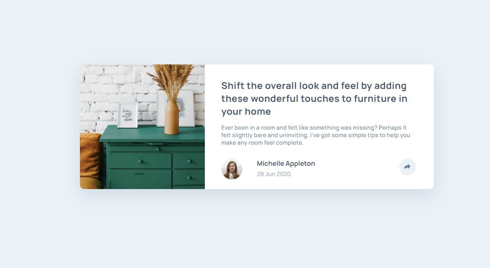

# Frontend Mentor - Article preview component

(./design/desktop-preview.jpg)

## Overview

Users should be able to:

-  View the optimal layout for the component depending on their device's screen size
-  See the social media share links when they click the share icon

### Screenshot

### Links

-  Solution URL: [Solution URL here](https://www.frontendmentor.io/solutions/article-preview-component-flexboxgridtypescript-kdovxM0eoz)
-  Live Site URL: [Live site URL here](https://bespoke-jalebi-8868fb.netlify.app/)

### Built with

-  Semantic HTML5 markup
-  CSS custom properties
-  Flexbox
-  Grid
-  Mobile-first workflow
-  [Typescript](https://www.typescriptlang.org/)
-  [Sass](https://sass-lang.com/)

### What I learned

-  My fisrt Typescript deployment

### Useful resources

-  [Mozilla developers resources](https://developer.mozilla.org/)

## Author

-  Frontend Mentor [@malboyoo](https://www.frontendmentor.io/profile/malboyoo)
-  LinkedIn [Thibaut Lefevre](https://www.linkedin.com/in/thibaut-lefevre-b60101117/)
